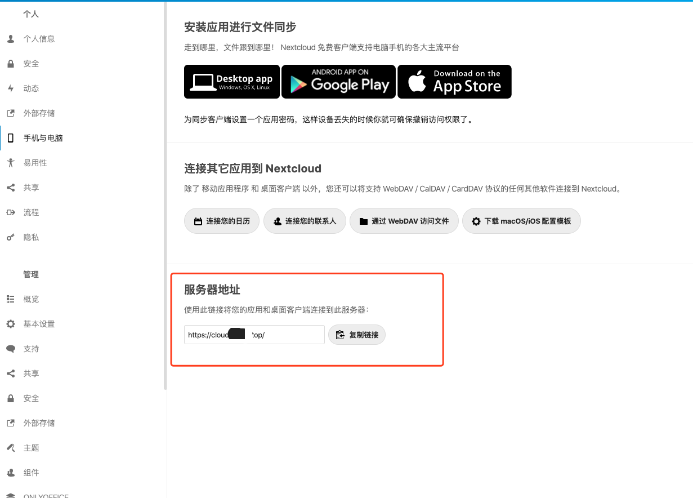

title: 给外网nextcloud设置服务器地址
author: weihai
tags:
  - nextcloud
  - proxy
categories: []
date: 2020-03-24 09:47:00
---
# 给外网nextcloud设置服务器地址

最近搭建了自己的nextcloud，但是电脑客户端登录时遇到验证问题，验证时跳转的域名总是localhost，并不是我外网的真实域名。

查了nextcloud很多设置，终于在侧边栏“手机与电脑”设置中，找到一个“服务器地址”的设置。这里出问题时显示的就是localhost加一个端口号，现在通过修改配置改成了自己外网的域名。

### 如何修改服务器地址
> 我参考了这片文章 https://blog.haitianhome.com/nextcloud-config-php.html?replytocom=77#respond

只修改了两个字段

    'overwritehost' => 'cloud.xxx.xxx',		    #重写地址
    'overwriteprotocol' => 'https',		  #协议, 可选 : HTTP、HTTPS
